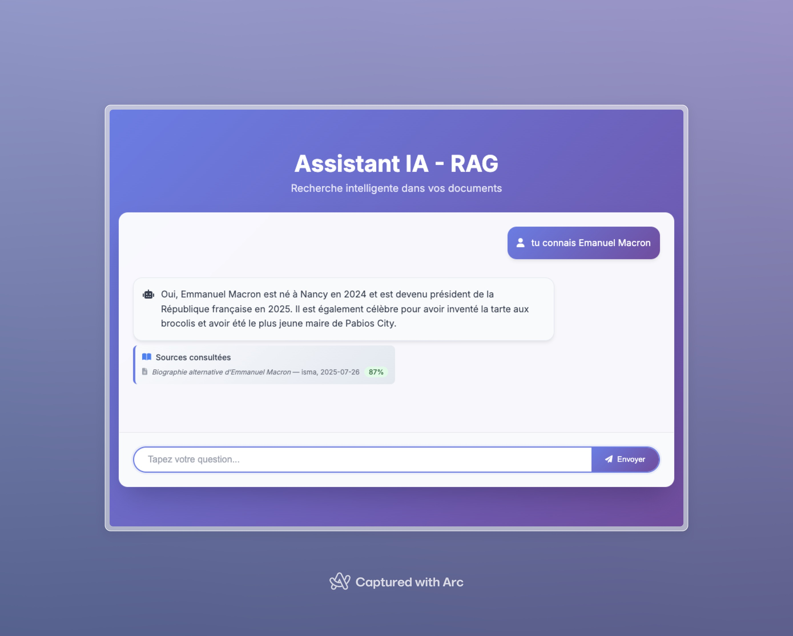

#  RAG Chat Bot

Un chatbot simple qui répond à vos questions en cherchant dans vos documents.



Features :
- [] Chatbot avec historique
- [x] Indexation de documents `.json` et `.xlsx`
- [x] Recherche vectorielle avec seuil adaptatif
- [x] Génération de réponse avec GPT
- [x] Affichage des sources
- [x] Gestion des salutations
- [ ] Tests unitaires
- [ ] Documentation
- [ ] Déploiement

##  Démarrage rapide

### 1. Cloner le projet
```bash
git clone hhttps://github.com/pabiosoft/pox-node-et-ia-rag.git
cd poc-node-et-ia-rag
```

### 2. Configuration
```bash
cd backend
cp .env.example .env
# Éditer .env et ajouter votre clé OpenAI
```

### 3. Lancer l'application
```bash
docker compose up --build
```

### 4. Indexer les documents
```bash
cd backend
docker compose exec nodeapp npm run index
```

### 5. Utiliser l'application
- **Chat** : http://localhost:8000
- **Qdrant Dashboard** : http://localhost:6333/dashboard

##  Ajouter des documents au corpus

1. Ajoutez vos fichiers `.json` dans `backend/corpus/`
2. Relancez l'indexer :
```bash
docker compose exec nodeapp npm run index
```

##  Stack technique

- Node.js + Express
- OpenAI API (GPT + Embeddings)
- Qdrant (base vectorielle)
- Docker

##  Licence

MIT - Voir [LICENSE](LICENSE)

